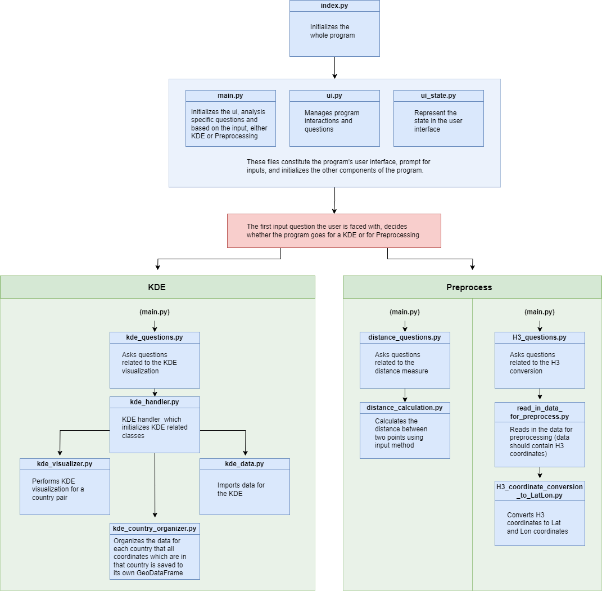

# BorderRegion_KDE
This program imports, handles, organizes, and visualizes data about mobility patterns over European national borders.
The primary analysis is a Kernel Density Estimation (KDE) of mobility across country borders. Several variations and calculations to the program are further discussed in the *Usage* part. This program can be helpful in understanding transnational locations as well as provide insight into movement trends.

In this program, the user can aside from visualizing mobility data, also convert H3 coordinates to Lat and Lon coordinates as well as calculate the distance between the starting and ending point of a mobility. This distance can then be used in the KDE visualization to determine the range of mobility that is considered in the KDE. 

## Installation
This program has **dummy data** which you can try if it works as it should on your computer. Before you can run the program, a **.env file has to be created** (instructions below) from where the **get_dotenv** file retrieves the paths and filenames for the program. Other than that, everything else is set up for you to test the program with the dummy data. The dummy data works currently only for the KDE plot and not for the H3 to geo conversion. The distance is also already calculated in the dummy data, so no need to calculate the distance between points. To test the program with the dummy data, follow the installation steps below and create a .env file, everything else should have been already taken care of.

### To install this program you need to 

**1. Navigate to a proper directory in your command line.**

**2. Clone the GitHub repository with the command below:**
```
git clone https://github.com/DigitalGeographyLab/BorderRegion_KDE.git
```
**3. Install Poetry if you don't have it installed already. More about installing Poetry [here](https://python-poetry.org/docs/)**

**4. Navigate into the BorderRegion_KDE folder.**

**5. Use Poetry to install all project dependencies with the command below, make sure you're inside the git repository in your command line:**
```
poetry install
```
**6. Use Poetry to active the virtual environment with this command:**
```
poetry shell
```
**7. After everything is installed and set upped, navigate to the *src* file and execute the program with one of the following commands:**
```
python index.py 
```
```
python3 index.py
```
## Usage

This section gives an overview of the program and gives guidance on where and how the user should start the program as well as an illustration of the program structure.

### How and where to start

#### Preparation with dummy data

- In the root directory, a .env file has to be created. In the .env file, the paths and filenames are defined so that the program finds the files. When using the dummy data, the user can copy and paste the text below into the .env file:
```
DATA_FOLDER_PATH = './DummyData/'
OUTPUT_FOLDER_PATH = './OutputFolder/'
OUTPUT_ALL = 'output_all/'
FILE_NAME_FOR_KDE_ANALYIS = 'pt_es_dummy_data_with_Haversine_distance.csv'
FILE_NAME_FOR_GPKG = 'pt_es_dummy_data_borders.gpkg'
```
#### Preparation with own data

- In the root directory, a .env file has to be created. When the user is using their own data or file structure, they need to add those paths and filenames to the .env file.
- A table of the kind of data that is needed for the program when using own data:
- Within the CountryCodes folder there is the lst_of_cntr_od file which contains a list of country pairs, change the content of this list if your country pairs are some others. 

|   Data   | Data type |   Columns   |
|:---------|:---------|:---------|
|Point Data with H3 coordinates|.parquet/.csv|:---------|
|Point Data with Lat/Lon|.csv|:---------|
|Country border data|.gpkg|:---------|


   
#### Preprocess & KDE
**N.B** when using dummy data, jump straight to step 4 as the above steps are already done to the dummy data.
1. If the user's input data consists of H3 coordinates, then the user should first **Preprocess** the data so that those coordinates are converted to lat and long coordinates. The converted coordinates and the previous columns are saved to a DataFrame which is saved to a .csv file. **N.B** *The program accepts input data that is either in .parquet or .csv file format.*
2. After the user has converted the H3 coordinates or if the user already has a dataset with lat and long coordinates, then the user can calculate the distance (geodesic, haversine, great circle) between the starting and ending point on each row in the dataset, this will create a new column in the DataFrame which also is saved to a new .csv file. **N.B** *.csv file format is the only format that the program accepts when loading data for the distance calculation.*
3. When the user has done preprocessing (if that was needed), then the user does not have to redo the Preprocessing again as long as the created .csv files are saved and the paths to them are found in the .env file as these files will be used in the KDE visualization. 
4. Now the user can proceed to the KDE visualization by selecting KDE in the first input question, this will print additional input questions about the KDE (questions below and example inputs):
   - **Do you want to do a KDE for a specific country pair or all country pairs (pair/all):** *pair*
   - **What Bandwidth in meters do you want to use (40km as 40000):** *20000*
   - **Which kernel type do you want to use (gaussian/epanechnikov):** *epanechnikov*
   - **Which metric type do you want to use (euclidean/haversine):** *haversine*
   - **Do you want to limit movement distances (yes/no):** *yes*
   - **How many kilometres radius do you want to limit the movement (200km as 200):** *300*
 
   - **Add first country abbreviation:** *ES*
   - **Add second country abbreviation:** *PT*
5. The values in the parentheses, are examples or options of what the input can be. The **slash(/)** between the values indicates on an option between those two values and **as** indicates that any value is accepted but it has to be written like that so e.g if the user wants a bandwidth (search radius) of 20km, then it has to be written in meters as 20000.
6. After the input questions are answered, the program starts and shows plots, the first two plots are each country's own KDE plot and the third one is a combined KDE.
The following files are saved in the output folder:
   - Combined KDE in .png format
   - Combined KDE in .gpkg format
   - Each country's KDE in .gpkg format (this is used by the program)

**N.B** Choosing **euclidean** as the metric type can result in errors in some cases while **epanechnikov** always works.  

### StandaloneKDE
- The Standalone KDE consists of a function that is run by itself and there the user can add a list of country pairs and different parameters which are iterated through. This is useful if the user wants to test different combinations of parameters and how they affect the KDE.


### Illustration of the program structure

Below is an illustration of how the src folder is organized and a short description of what each *class* does for clarity. The blue boxes indicate a class (Python file) and the green boxes indicate a folder. All folders and files are not in this illustration as they function as support code for these classes.




### Referencing
If you use this script in your research or project, or develop it further, please refer back to us using this:

Söderholm, M., Aagesen, H., Väisänen, T., & Järv, O (2023) BorderRegion_KDE

### Acknowledgement

### Disclaimer
